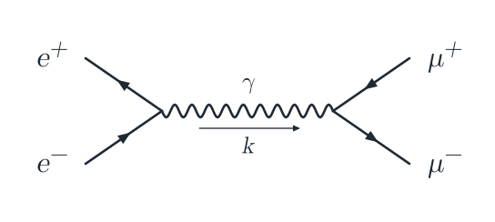
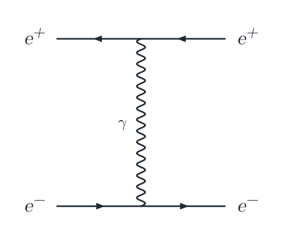
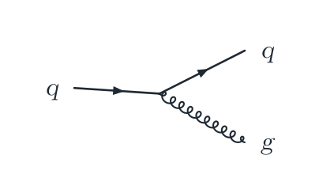
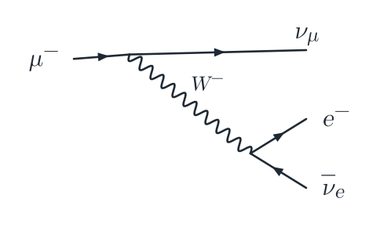
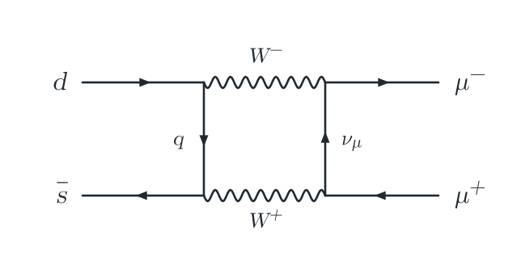

# MarkFeyn

[](https://github.com/lalmei/markfeyn/actions/workflows/ci.yml)
[](https://lalmei.github.io/markfeyn/)

📖 **Documentation:** https://lalmei.github.io/markfeyn/

MarkFeyn renders fenced `feynman` code blocks as native SVG diagrams in MkDocs and ProperDocs.

## Examples

A short text-based syntax produces publication-style diagrams, from simple
tree-level scattering to loops and QCD vertices. More examples live in
[`docs/examples/`](docs/examples/).

<table>
<tr>
<th>Source</th>
<th>Rendered</th>
</tr>
<tr>
<td>

```feynman
incoming e_minus e_plus
outgoing mu_plus mu_minus
fermion e_minus->ann
anti fermion e_plus->ann
photon ann->prod[momentum'=k]
anti fermion prod->mu_plus
fermion prod->mu_minus
label e_minus:e^- e_plus:e^+ mu_plus:\mu^+ mu_minus:\mu^- ann->prod:\gamma
```

</td>
<td></td>
</tr>
<tr>
<td>

```feynman
incoming  e_minus  e_plus
outgoing e_plus_out e_minus_out
fermion e_minus->upper upper->e_minus_out
photon upper->lower[edge label=\gamma]
anti fermion e_plus->lower lower->e_plus_out
label e_minus:e^- e_plus:e^+ e_minus_out:e^- e_plus_out:e^+
```

</td>
<td></td>
</tr>
<tr>
<td>

```feynman
incoming q
outgoing q2 g
fermion q->v1 v1->q2
gluon v1->g
label q:q q2:q g:g
```

</td>
<td></td>
</tr>
<tr>
<td>

```feynman
incoming mu
outgoing numu e nue
fermion mu->v v->numu
boson v->w
fermion w->e
anti fermion w->nue
label mu:\mu^- numu:\nu_\mu e:e^- nue:\overline{\nu}_e v->w:W^-
```

</td>
<td></td>
</tr>
<tr>
<td>

```feynman
incoming i1 i2
outgoing f1 f2
fermion i1->a b->f1 a->c[edge label'=q]
anti fermion i2->c d->f2 b->d[edge label=\nu_\mu]
photon a->b[edge label=W^-] c->d[edge label'=W^+]
label i1:d i2:\overline{s} f1:\mu^- f2:\mu^+
```

</td>
<td></td>
</tr>
</table>

The exact sources used to render these images (including the layout options
that were trimmed above for brevity) are under
[`docs/assets/readme/`](docs/assets/readme/), and can be re-rendered with
`npm run render:readme`.

## Installation

From PyPI:

```bash
uv add markfeyn
```

This installs both supported documentation engines as runtime dependencies so the same package exposes both plugin entry points. Install Material for MkDocs when using the Material theme:

```bash
uv add mkdocs-material
```

From a source checkout:

```bash
uv sync
```

For local development:

```bash
uv sync --group dev
```

## MkDocs Setup

Enable the plugin in `mkdocs.yml`:

```yaml
theme:
  name: material

plugins:
  - search
  - feynman-diagrams

markdown_extensions:
  - pymdownx.highlight:
      anchor_linenums: true
      pygments_lang_class: true
  - pymdownx.superfences:
      custom_fences:
        - name: feynman
          class: language-feynman
          format: !!python/name:pymdownx.superfences.fence_code_format
```

## ProperDocs Setup

Enable the same plugin in `properdocs.yml`:

```yaml
theme:
  name: material

plugins:
  - feynman-diagrams

markdown_extensions:
  - pymdownx.highlight:
      anchor_linenums: true
      pygments_lang_class: true
  - pymdownx.superfences:
      custom_fences:
        - name: feynman
          class: language-feynman
          format: !!python/name:pymdownx.superfences.fence_code_format
```

The plugin injects and copies the bundled browser renderer automatically. The Markdown parser stays lightweight because diagram parsing and SVG generation happen in the browser.

For ProperDocs with `theme: material`, do not add `search` explicitly; Material's `search` plugin is MkDocs-only.

To customize the emitted script path:

```yaml
plugins:
  - search
  - feynman-diagrams:
      script_path: assets/javascripts/feynman-diagrams.js
```

`script_path` is interpreted relative to the generated site directory. Parent-directory traversal such as `../feynman.js` is rejected.

## Syntax

````markdown
```feynman
incoming e_minus e_plus
outgoing mu_plus mu_minus
fermion e_minus->ann
anti fermion e_plus->ann
photon ann->prod[momentum'=k]
anti fermion prod->mu_plus
fermion prod->mu_minus
label e_minus:e^- e_plus:e^+ mu_plus:\mu^+ mu_minus:\mu^- ann->prod:\gamma
```
````

Visible degree-1 endpoints without `incoming` or `outgoing` declarations are
kept as unclassified external states and laid out symmetrically when no process
direction is declared. Balanced two-center trees and symmetric two-point
self-energy loops without explicit roles receive focused reflection-symmetric
refinement; this is not a full automorphism engine. Add `incoming` and
`outgoing` for left-to-right process diagrams and explicit terminal ordering.

Supported particles:

- `plain`, `line`, or `propagator`: solid line without an arrow
- `fermion`: solid line with centered arrow
- `anti fermion` or `anti-fermion`: solid line with reversed arrow
- `photon`: sinusoidal wave
- `boson`: alias for `photon`
- `gluon`: looped/cycloid path
- `scalar`: dashed line
- `ghost`: dotted line
- `invisible` or `hidden`: layout-only edge

Labels use `node:text`. Edge labels are also accepted with `from->to:text`.
Labels support a small TeX-like subset for common symbols and scripts:

```feynman
label electron:e^- muon:\mu^- vertex:\gamma momentum:p_{T}
```

Per-edge options support TikZ-Feynman-style curves and inline labels:

```feynman
fermion b->c[half left, momentum=k] c->b[half left, momentum'=k-p]
boson d->e[bend left, edge label=W^+]
fermion f->g[out=180, in=45]
```

Use `brace from->to[side]:label` for grouping braces on manually positioned
diagrams.

Diagram-level options can select layout algorithms, orientation, and sizing:

````markdown
```feynman
layout spring
orientation vertical
size small
options width=560 height=420
incoming mu
outgoing numu nue e
fermion mu->w w->numu
boson w->v
anti fermion nue->v
fermion v->e
invisible numu->e
label mu:\mu^- numu:\nu_\mu nue:\nu_e e:e^- w->v:W^-
```
````

Supported layouts are `spring` (default), `spring-electrical`, `layered`, and
`tree`, all backed by bundled ELK.js graph layout. Pin nodes manually with
`position node x y` when an automatic layout is not enough.

Common loop topologies also get semantic candidate layouts: triangle loops, box
loops, tadpoles, generic polygon loops, centered vacuum one-loop diagrams, and
bounded two-loop nested or overlapping regions are detected and placed
deterministically before falling back to the general graph layout. Candidate
scoring includes approximate label, momentum, multiloop recognizability, and
previous-layout stability checks. Final layouts also run deterministic,
bounding-box-based label placement so node labels, edge labels, and momentum
labels can move away from nearby vertices, propagators, loop interiors, and
other labels while preserving explicit primed/right-side choices. It still does
not attempt arbitrary higher-order multiloop optimization or exact TeX/TikZ
font metrics.

TikZ-Feynman-style post-layout alignment is available with commands such as
`horizontal a to b`, `horizontal' a to b`, `vertical a to b`, and
`vertical' a to b`.

Vertex shapes can be selected with `vertex node:shape` pairs:

````markdown
```feynman
incoming a
outgoing b c
fermion a->v v->b
photon v->blob blob->c
vertex v:dot blob:blob
label a:e^- b:e^- c:\gamma
```
````

Internal vertices are unmarked by default; use `vertex v:dot` for a small
filled interaction point.

Supported shapes are `dot`, `square-dot`, `empty-dot`, `crossed-dot`, `cross`,
`blob`, and `disk`.

Blob and disk vertices can use optional bracketed styling:

````markdown
```feynman
incoming a
outgoing b
plain a->disk disk->b
vertex disk:disk[hatch=cross,width=96,height=44]
```
````

Supported hatch fills are `diagonal`, `diagonal-reverse`, `cross`,
`horizontal`, `vertical`, and `grid`; TikZ-style aliases such as
`north east lines` and `north west lines` are accepted. `size` and `radius`
set the circular radius in SVG pixels, and `diameter` sets the full circle
width. Use `width` and `height` for full elliptical extents, or `rx` and `ry`
for horizontal and vertical radii. Unequal horizontal and vertical radii render
as an SVG ellipse.

## Manual JavaScript Setup

If you do not want to use a plugin, copy the bundled renderer:

```bash
python -m markfeyn copy-asset docs/javascripts/feynman-diagrams.js
```

(Source checkouts can also copy `src/markfeyn/assets/feynman-diagrams.js` directly.)

Then configure MkDocs or ProperDocs directly:

```yaml
extra_javascript:
  - javascripts/feynman-diagrams.js

markdown_extensions:
  - pymdownx.highlight:
      anchor_linenums: true
      pygments_lang_class: true
  - pymdownx.superfences:
      custom_fences:
        - name: feynman
          class: language-feynman
          format: !!python/name:pymdownx.superfences.fence_code_format
```

## Package Layout

```text
src/markfeyn/
  __init__.py
  core.py
  mkdocs_plugin.py
  properdocs_plugin.py
  renderer/
    feynman-diagrams.js
  assets/
    feynman-diagrams.js
```

The package exposes both plugin entry points:

```toml
[project.entry-points."mkdocs.plugins"]
feynman-diagrams = "markfeyn.mkdocs_plugin:FeynmanDiagramsPlugin"

[project.entry-points."properdocs.plugins"]
feynman-diagrams = "markfeyn.properdocs_plugin:FeynmanDiagramsPlugin"
```

## Verification

```bash
make test
make docs
make build
```

Serve docs locally:

```bash
make serve-properdocs
make serve-mkdocs
```

The serve targets use `localhost:8001` by default. Override with `DOCS_ADDR=localhost:8010` if that port is busy.

## Publishing

Build and publish to PyPI:

```bash
make publish
```

The publish targets upload only `dist/markfeyn-*` artifacts.

Publish to TestPyPI first:

```bash
make publish-test
```

`uv publish` reads credentials from the environment. For PyPI token auth, set:

```bash
export UV_PUBLISH_TOKEN="pypi-..."
```

## Design Choices

- Rendering happens in the browser, so MkDocs and ProperDocs builds remain static and fast.
- MkDocs and ProperDocs use separate adapter classes over the same core implementation.
- The script supports themes that expose Material-style instant loading through `document$.subscribe`.
- It falls back to `DOMContentLoaded` for standard static documentation themes.
- The browser renderer has no JavaScript runtime dependencies.
