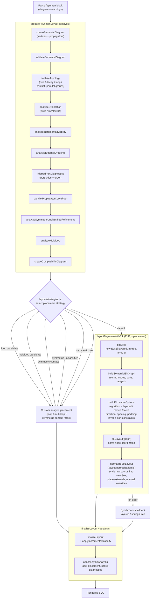
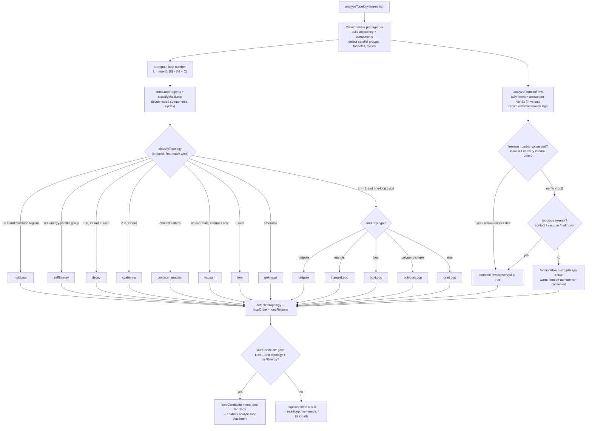

# Development

Install dependencies:

```bash
uv sync --group dev
npm install
```

The development dependency group includes `mkdocs-material`, which is used by both local MkDocs and ProperDocs documentation builds.
The npm dependencies bundle the browser renderer with ELK.js.

Build the JavaScript renderer:

```bash
make build-js
```

Run Python tests:

```bash
make test-py
```

Run JavaScript checks:

```bash
make test-js
```

Build both documentation variants:

```bash
make docs
```

Build one documentation engine:

```bash
make docs-mkdocs
make docs-properdocs
```

Serve documentation locally:

```bash
make serve-mkdocs
make serve-properdocs
```

The serve targets bind to `localhost:8001` by default to avoid the common `localhost:8000` collision. Override it when needed:

```bash
make serve-properdocs DOCS_ADDR=localhost:8010
make serve-mkdocs DOCS_ADDR=localhost:8011
```

Build distribution artifacts:

```bash
make build
```

Publish when release credentials are configured:

```bash
make publish
```

For TestPyPI:

```bash
make publish-test
```

`uv publish` reads credentials from the environment. For token auth, set `UV_PUBLISH_TOKEN`.

The publish targets upload only `dist/markfeyn-*` artifacts.

## Package Shape

```text
src/markfeyn/
  __init__.py
  core.py
  mkdocs_plugin.py
  properdocs_plugin.py
  renderer/
    feynman-diagrams.js        # bundle entrypoint + public API assembly
    parser/                    # block parsing facade and syntax helpers
    layout/                    # semantic analysis, placement strategies, ELK, fallback layouts
    layout/topology/           # graph/topology helper modules
    render/                    # SVG paths, elements, labels, MathJax, styles, DOM boot
  assets/
    feynman-diagrams.js        # generated browser bundle
```

The plugin entry points are declared in `pyproject.toml`:

```toml
[project.entry-points."mkdocs.plugins"]
feynman-diagrams = "markfeyn.mkdocs_plugin:FeynmanDiagramsPlugin"

[project.entry-points."properdocs.plugins"]
feynman-diagrams = "markfeyn.properdocs_plugin:FeynmanDiagramsPlugin"
```

## Layout Pipeline

A Feynman code block travels through three broad phases before it becomes SVG:
**analysis** (`prepareFeynmanLayout`), **placement** (a strategy is chosen, with the
ELK force/layered/tree engines as the default path), and **finalization**
(normalization, scoring, and diagnostics). The diagram below traces how the parsed
diagram is processed and how its nodes are ultimately placed by ELK.js.



### Topology analysis: checking topology and computing the loop number

The `analyzeTopology` box above is the heart of the analysis phase: it inspects the
graph, **computes the loop number**, and **classifies the topology** into a named
type that later drives placement-strategy selection. `TopologyAnalyzer` runs in
`src/markfeyn/renderer/layout/topology.js` as the facade, with cycle detection,
biconnected components, loop regions, and parallel-edge grouping split under
`src/markfeyn/renderer/layout/topology/`. This happens on the semantic diagram,
before any coordinates exist.

The loop number is the graph's [cyclomatic
number](https://en.wikipedia.org/wiki/Circuit_rank) computed over the *visible*
(non-hidden) propagators:

\[
L = \max\bigl(0,\; |E| - |V| + C\bigr)
\]

where \(|E|\) is the visible edge count, \(|V|\) is the vertex count, and \(C\) is
the number of connected components. The same formula is applied per biconnected
component to derive per-region loop orders, and every primitive cycle region is
assigned \(L = 1\).

Once \(L\) is known, `classifyTopology` walks an ordered decision tree (first match
wins) to label the diagram. In parallel, `analyzeFermionFlow` checks **fermion-number
conservation** (see below). That label, the loop number, and the fermion-flow result
together gate which placement strategy the renderer chooses and whether the diagram
is flagged as a *custom graph*.



The resulting `detectedTopology`, `loopOrder`, `loopRegions`, `loopCandidate`, and
`fermionFlow` are consumed downstream when `layout/strategies.js` selects a
placement strategy (loop-candidate, multiloop, symmetric, tree, or the default ELK
path) and by `scoreLayout` when ranking the final geometry.

### Fermion flow and fermion-number conservation

External and internal fermions carry a directed **fermion flow** (the arrow set by
`fermion` / `anti fermion` or the `[reverse]` / `[forward]` options, exposed as
`propagator.fermionFlow` on the semantic model). A fermion line is a continuous,
directed path that only terminates on external legs, so fermion number is conserved
exactly when **the number of fermion arrows entering each internal vertex equals the
number leaving it**. `analyzeFermionFlow` (`layout/topology/fermion-flow.js`)
tallies that balance, lists the external fermion legs (with their `incoming` /
`outgoing` direction relative to the diagram), and returns:

| Field | Meaning |
| ----- | ------- |
| `conserved` | `false` when some internal vertex has `in ≠ out` (with all arrows specified) |
| `violations` | The offending internal vertices and their `in` / `out` counts |
| `externalFermions` | External fermion legs and whether each flows into or out of the diagram |
| `unresolved` | `true` when arrows are unspecified, so conservation cannot be decided |
| `customGraph` | `true` when fermion number is not conserved **and** the topology is not exempt |

When fermion number is not conserved the diagram is treated as a **custom graph**:
`customGraph` is set and a `fermion-number-not-conserved` topology warning is emitted
through the usual `limitations` → diagnostics path. This is a *recognition* signal —
structural placement still runs so the diagram is drawn — but the topology is marked
unverified rather than claimed as a standard process. Contact interactions, vacuum
graphs, and already-`unknown` graphs are exempt, because they are effective point
vertices or unrecognized structures where continuous fermion lines are not expected.

### How layout names map to ELK algorithms

The requested `layout` option drives which ELK algorithm runs inside
`buildElkLayoutOptions`:

| `layout` option           | ELK algorithm (`elk.algorithm`) |
| ------------------------- | ------------------------------- |
| `layered` (default)       | `layered`                       |
| `tree`                    | `mrtree`                        |
| `spring` / `spring-electrical` | `force`                    |

Layered placement additionally pins external `incoming` vertices to the `FIRST`
layer and `outgoing` vertices to the `LAST` layer, and inferred ports
(`WEST`/`EAST` sides with a fixed order) keep propagators attached on the correct
side of each vertex. After ELK solves the raw coordinates, `normalizeElkLayout`
rescales them into the diagram's view box, places the external legs, and applies any
manual position overrides.
